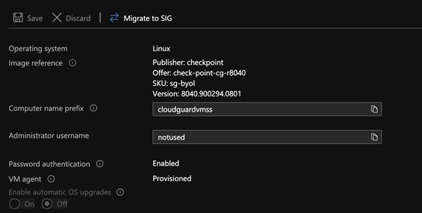

# How to configure VMSS to spin up CGI gateways from a specific image

This tutorial explains how to configure CloudGuard VMSS to spin up new gateways from a particular CGI image (with a particular jhf installed) instead of the “latest version” which is by default. 

1. Execute the following on command line and check the image version of existing VMSS.

> (This requires AZ cli to be installed and configured with an appropriate privileges. And replace ```cloudguardvmss``` with your VMSS name and Resource Group name.)

```bash
 az vmss show --resource-group cloudguardvmss --name cloudguardvmss | jq -r '.virtualMachineProfile.storageProfile.imageReference'
```


You should see similar output with the version being specified as “latest”.

```bash 
{
  "exactVersion": null,
  "id": null,
  "offer": "check-point-cg-r8040",
  "publisher": "checkpoint",
  "sku": "sg-byol",
  "version": "latest"
}
``` 

2. Execute the following to update the image to the version you want. In this scenario I’m updating the image version to the version number ```8040.900294.0801``` of “check-point-cg-r8040” offer. 

```bash 
az vmss update --resource-group cloudguardvmss --name cloudguardvmss --set virtualMachineProfile.storageProfile.imageReference.version= 8040.900294.0801

```

3. If the command is successful, execute the following to check the image version again.

```bash 

az vmss show --resource-group cloudguardvmss --name cloudguardvmss | jq -r '.virtualMachineProfile.storageProfile.imageReference'

``` 

Now you should see the version has been updated to the specific version that you want.

```bash 
{
  "exactVersion": null,
  "id": null,
  "offer": "check-point-cg-r8040",
  "publisher": "checkpoint",
  "sku": "sg-byol",
  "version": "8040.900294.0801"
}
```

4. Double check on the Azure portal as well.

 


5. Check [the list of CGI images](json/cgi-azure-images-16022021.json) (as of 16th Feb 2021) on Azure. Please take note that you cannot update the version of an image in VMSS to any version you see in the list. You need to check the “offer” in the list. For example, if your existing VMSS is using the offer “check-point-cg-r8040”, then you can only update the version numbers that are associated with that offer. 

6. Lastly, manually scale up a new gateway in VMSS to test out if it is indeed spinning up gateways from the particular image that you’ve updated in the configuration. Specify the number of total VMs with ``` ---new-capacity``` flag. 

```bash
az vmss scale --name cloudguardvmss --new-capacity 2 --resource-group cloudguardvmss
``` 

Once the new gateway is up and part of the VMSS,  execute the following to compare the versions of existing 

```bash
az vmss list-instances --resource-group cloudguardvmss --name cloudguardvmss | jq -r '.[].storageProfile.imageReference.version'
```

You should see similar out put like this: 

```bash
latest
8040.900294.0801
```

I’ve two instances in my VMSS group, and the first version is of the latest image version (default) and the second one is the version that we’ve just updated. 

Now your CloudGuard VMSS has been configured to spin up CloudGuard gateways from a specific image version. 

Best, \
Jayden Aung

