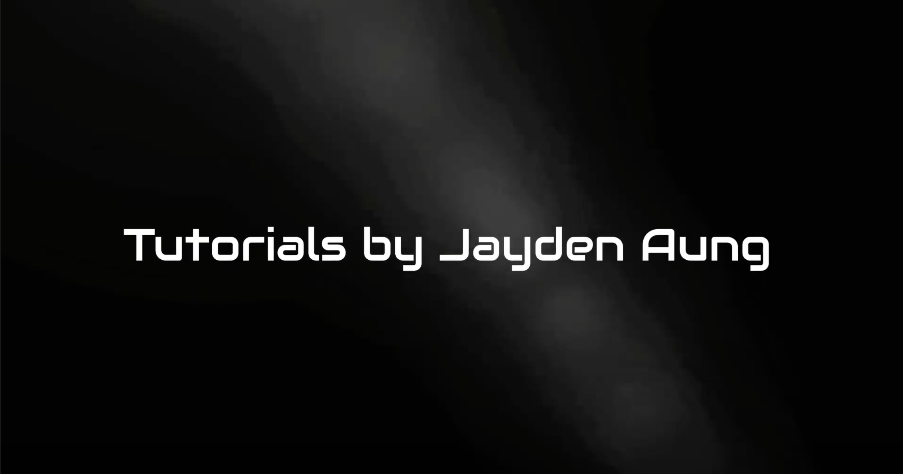

# Useful Scripts and Tutorials for Check Point CloudGuard

Just a repo to share some of the useful scripts I've used and tutorials. I'll keep updating this repo as I come across new use cases.

## Scripts 
1. [autoprov_cfg_aws.sh](scripts/autoprov_cfg_aws.sh) - CME initialization script for AWS

2. [autoprov_cfg_azure.sh](scripts/autoprov_cfg_azure.sh) - CME initialization script for Azure 

3. [cgi-gcp-setup.sh](scripts/cgi-gcp-setup.sh) - Deploy a CloudGuard FW using a custom image (not listed in the templates)

4. [How to forward CloudGuard logs to CloudWatch via proxy instance](https://github.com/jaydenaung/aws-cloudwatch-proxy-instance-for-cloudguard)

### Check out HowTos:

1. [How to Configure Azure VMSS to spin up CloudGuard gateways from a specific image.](HowTo/CGI-VMSS-custom-image.md)

2. How to deploy a Check Point CloudGuard network security gateways on Azure using ARM templates (YouTube Video)

3. How to deploy Check Point CloudGuard network security cluster on AWS  (CCVSA Lab YouTube Video)

